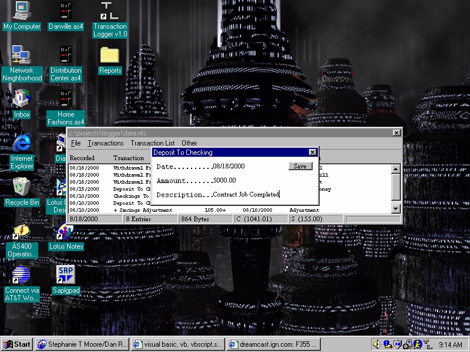



## Transaction Logger v1\.1 \*Complete Program/With Source\*

### Description

This is an application to record and calculate your savings and checking account. This program is a great bit of source all the way around, commondialog, systray, listbox function, simple print functions, plus much more. I use this program and it comes in handy especially if you hate balancing your checkbook. This program if properly used could do away with balancing your checkbook. This is my first edition of this program and if you need any help understanding this program, please feel free to email me at CrazyAssNate@aol.com. I apologize for no help file and no documented code, but most of it is pretty straight forward. Please vote for me if you like. Any suggestions are well appreciated, and if you use this program or make updates, please note me as the original author. PLEASE VOTE 4 ME.

Transaction Logger v1.1

*File

New - To Create a new data file which records can be stored, edited, and saved

Open - To open a data file

Save - To save your current data file

Restore Data - To restore the backup file.

Backup Data - To backup your data to another file called databu.nfs

Delete - Delete current data file

Default File - To set the default file for which

Transaction Logger loads automatically

Print - Prints all records for loaded data file

*Transactions

Deposit To Checking/Savings - Whenever there is a positive transaction to either account

Withdrawal From Checking/Savings - Whenever there is a negative transaction to either account

Transfer - Whenever you want to Transfer funds from one account to the other

Adjustment - Used as a problem solver. Say you have 35 cents extra in your checking account and you aren't sure how it got there, you can simply adjust your account + 35 cents to make up for the extra funds. Used for positive and negative adjustments for all transaction.

*Transaction Lists

Shows the transactions by type, just select which one you want to see.

Details - Shows the number of entries per transaction type and dollar ammount.

Search - Search entire data list for your search criteria

Show all - Returns data list back to original state. If you do a search or look at a particular transaction type the list changes, therefore this is needed to view the entire list. The entire list is automatically shown at startup.

* Other

Datapad - Used to store any extra info

Calendar - Shows calendar

* Mouse buttons

Double click entry to edit a particular entry.

Right click to delete entry.
 
### More Info
 

             |
---                |---
**Submitted On**   |2000-08-18 11:10:06
**By**             |[Nathan](https://github.com/Planet-Source-Code/PSCIndex/blob/master/ByAuthor/nathan.md)
**Level**          |Intermediate
**User Rating**    |2.8 (11 globes from 4 users)
**Compatibility**  |VB 5\.0, VB 6\.0
**Category**       |[Complete Applications](https://github.com/Planet-Source-Code/PSCIndex/blob/master/ByCategory/complete-applications__1-27.md)
**World**          |[Visual Basic](https://github.com/Planet-Source-Code/PSCIndex/blob/master/ByWorld/visual-basic.md)
**Archive File**   |[CODE\_UPLOAD90838182000\.zip](https://github.com/Planet-Source-Code/nathan-transaction-logger-v1-1-complete-program-with-source__1-10792/archive/master.zip)

